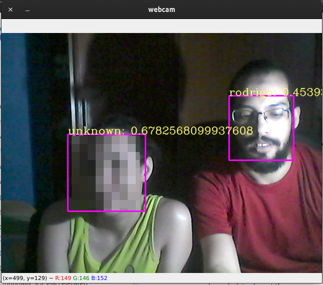

# Detecção e Reconhecimento de faces
Desenvolvimento e/ou implementação de algoritmos capazes de detectar e reconhecer faces, como:

- Biblioteca `face_recognition`: Possui um pequeno _delay_ para ser utilizado em tempo real, mas apresenta bons resultados:


## Execução
Com o ambiente virtual ativo execute:
```
python src/main.py
```
